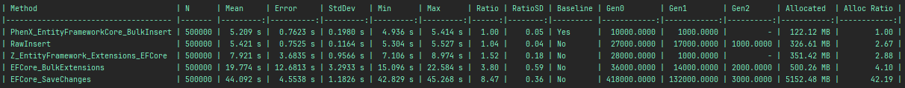
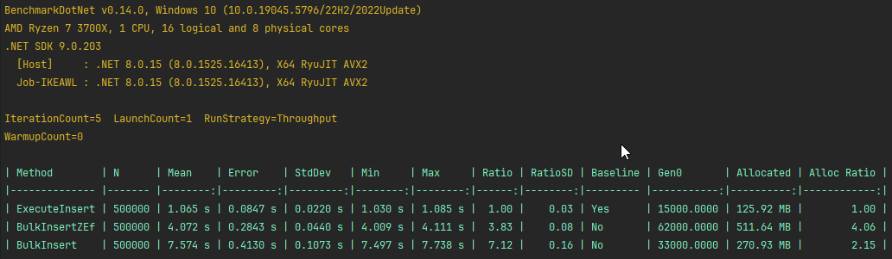
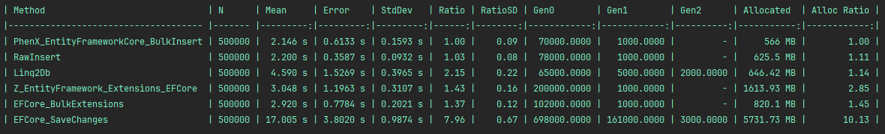

# PhenX.EntityFrameworkCore.BulkInsert

A high-performance, provider-agnostic bulk insert extension for Entity Framework Core. Supports SQL Server, PostgreSQL, SQLite.

Its main purpose is to provide a fast way to perform simple bulk inserts in Entity Framework Core applications.

## Why this library?

- **Performance**: It is designed to be fast and efficient, making it suitable for high-performance applications.
- **Provider-agnostic**: It works with multiple database providers (SQL Server, PostgreSQL, and SQLite), allowing you to use it in different environments without changing your code.
- **Simplicity**: The API is simple and easy to use, making it accessible for developers of all skill levels.

For now, it does not support navigation properties, complex types, owned types, shadow properties, or inheritance,
but they are in [the roadmap](#roadmap).

## Installation

Install the NuGet package for your database provider:

```shell
# For SQL Server
Install-Package PhenX.EntityFrameworkCore.BulkInsert.SqlServer

# For PostgreSQL
Install-Package PhenX.EntityFrameworkCore.BulkInsert.PostgreSql

# For SQLite
Install-Package PhenX.EntityFrameworkCore.BulkInsert.Sqlite
```

## Usage

1. Register the bulk insert provider in your `DbContextOptions`:

```csharp
services.AddDbContext<MyDbContext>(options =>
{
    options
        // .UseSqlServer(connectionString) // or UseNpgsql or UseSqlite, as appropriate
        .UseBulkInsert(); // <<< The important part
});
```

2. Use the bulk insert extension method:

```csharp
await dbContext.ExecuteInsertAsync(entities);
```

3. Optionally, you can configure the bulk insert options:

```csharp
await dbContext.ExecuteInsertAsync(entities, options =>
{
    options.BatchSize = 1000; // Set the batch size for the insert operation, the default value is different for each provider
});
```

4. You can also return the inserted entities (slower):

```csharp
await dbContext.ExecuteInsertWithIdentityAsync(entities, options => {});
```

## Roadmap

- [ ] [Add support for navigation properties](https://github.com/PhenX/PhenX.EntityFrameworkCore.BulkInsert/issues/2)
- [ ] [Add support for complex types](https://github.com/PhenX/PhenX.EntityFrameworkCore.BulkInsert/issues/3)
- [ ] Add support for owned types
- [ ] Add support for shadow properties
- [ ] Add support for TPT (Table Per Type) inheritance
- [ ] Add support for TPC (Table Per Concrete Type) inheritance
- [ ] Add support for TPH (Table Per Hierarchy) inheritance

## Benchmarks
Benchmark projects are available in the [`tests/PhenX.EntityFrameworkCore.BulkInsert.Benchmark`](tests/PhenX.EntityFrameworkCore.BulkInsert.Benchmark/LibComparator.cs) directory.
Run them to compare performance with other libraries (https://github.com/videokojot/EFCore.BulkExtensions.MIT and https://entityframework-extensions.net/bulk-extensions),
using optimized configuration (local Docker is required).

There is no need to compare with basic EF Core SaveChangesAsync, as it is significantly slower.

SQL Server results :


PostgreSQL results :


SQLite results :


## Contributing
Contributions are welcome! Please open issues or submit pull requests for bug fixes, features, or documentation improvements.

## License
MIT License. See [LICENSE](LICENSE) for details.
