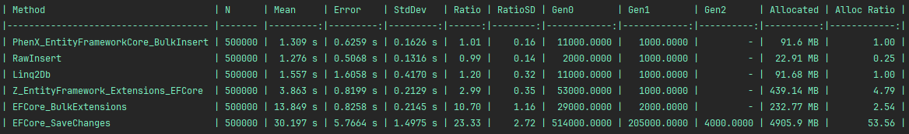
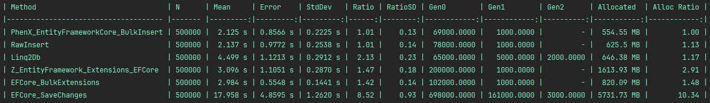

# EntityFrameworkCore.ExecuteInsert

A high-performance, provider-agnostic bulk insert extension for Entity Framework Core. Supports SQL Server, PostgreSQL, SQLite.

## Features
- Very fast bulk insert support for multiple database providers
- Supports SQL Server, PostgreSQL, and SQLite
- Simple and intuitive API
- Benchmarking and test projects included

## Installation

Install the NuGet package for your database provider:

```shell
# For SQL Server
Install-Package EntityFrameworkCore.ExecuteInsert.SqlServer

# For PostgreSQL
Install-Package EntityFrameworkCore.ExecuteInsert.PostgreSql

# For SQLite
Install-Package EntityFrameworkCore.ExecuteInsert.Sqlite
```

## Usage

1. Register the bulk insert provider in your `DbContextOptions`:

```csharp
services.AddDbContext<MyDbContext>(options =>
{
    options
        .UseSqlServer(connectionString) // or UseNpgsql or UseSqlite, as appropriate
        .UseBulkInsert(); // <<< The important part
});
```

2. Use the bulk insert extension method:

```csharp
await dbContext.ExecuteInsertAsync(entities);
```

3. Optionally, you can configure the bulk insert options:

```csharp
await dbContext.ExecuteInsertAsync(entities, options =>
{
    options.BatchSize = 1000; // Set the batch size for the insert operation, the default value is different for each provider
});
```

4. You can also return the inserted entities (slower):

```csharp
await dbContext.ExecuteInsertWithIdentityAsync(entities, options => {});
```

## Roadmap

- [ ] [Add support for navigation properties](https://github.com/PhenX/EntityFrameworkCore.ExecuteInsert/issues/2)
- [ ] [Add support for complex types](https://github.com/PhenX/EntityFrameworkCore.ExecuteInsert/issues/3)
- [ ] Add support for owned types
- [ ] Add support for shadow properties
- [ ] Add support for TPT (Table Per Type) inheritance
- [ ] Add support for TPC (Table Per Concrete Type) inheritance
- [ ] Add support for TPH (Table Per Hierarchy) inheritance

## Benchmarks
Benchmark projects are available in the [`tests/EntityFrameworkCore.ExecuteInsert.Benchmark`](tests/EntityFrameworkCore.ExecuteInsert.Benchmark/LibComparator.cs) directory.
Run them to compare performance with other libraries (https://github.com/videokojot/EFCore.BulkExtensions.MIT and https://entityframework-extensions.net/bulk-extensions),
using optimized configuration (local Docker is required).

There is no need to compare with basic EF Core SaveChangesAsync, as it is significantly slower.

SQL Server results :


PostgreSQL results :


SQLite results :


## Contributing
Contributions are welcome! Please open issues or submit pull requests for bug fixes, features, or documentation improvements.

## License
MIT License. See [LICENSE](LICENSE) for details.
