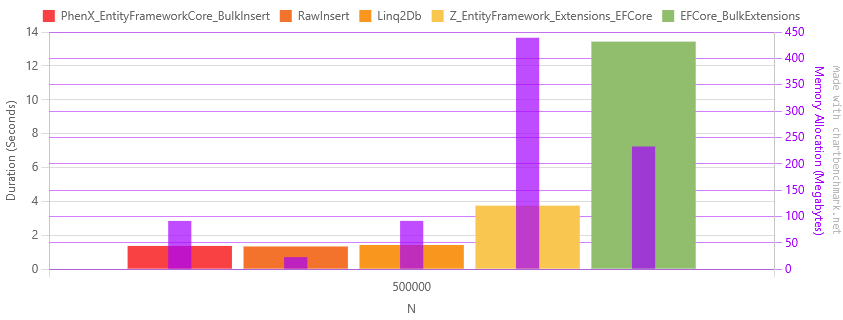

---
# https://vitepress.dev/reference/default-theme-home-page
layout: home

hero:
  name: "PhenX BulkInsert"
  text: "Super fast bulk insert for EF Core"
  tagline: A high-performance, provider-agnostic bulk insert extension for Entity Framework Core 8+. Supports SQL Server, PostgreSQL, SQLite, MySQL and Oracle.

  actions:
    - theme: brand
      text: Getting started
      link: /getting-started
    - theme: alt
      text: GitHub
      link: https://github.com/PhenX/PhenX.EntityFrameworkCore.BulkInsert

features:
  - icon: ⚡️
    title: High Performance
    details: Significantly faster data insertion with optimized SQL generation and batching.
  - icon: 💻
    title: Database Support
    details: Works with SQL Server, PostgreSQL, MySQL, SQLite and Oracle databases.
  - icon: 🔌
    title: Easy Integration
    details: Seamless integration with existing EF Core DbContext and models.
---

## It's fast !

The benchmark consists of inserting 500 000 records into a single table with various column types, using various methods to compare performance.
The results are shown for PostgreSQL, SQL Server, SQLite, MySQL and Oracle databases.

* **PhenX_EntityFrameworkCore_BulkInsert**: this library
* **RawInsert**: naive implementation without any library, using the native provider API (SqlBulkCopy for SQL Server, BeginBinaryImport for PostgreSQL, raw inserts for SQLite)
* **Linq2Db**: https://github.com/linq2db/linq2db
* **Z_EntityFramework_Extensions_EFCore**: https://entityframework-extensions.net/bulk-extensions
* **EFCore_BulkExtensions**: https://github.com/borisdj/EFCore.BulkExtensions

::: info
**EF Core SaveChanges** not included in the benchmark results as it's significantly slower than any bulk insert methods.
:::

The benchmark code is available on [GitHub](https://github.com/PhenX/PhenX.EntityFrameworkCore.BulkInsert/tree/main/tests/PhenX.EntityFrameworkCore.BulkInsert.Benchmark).

### PostgreSQL

| Method                                   |     Mean | Ratio |       Gen0 |      Gen1 | Gen2 | Allocated | Alloc Ratio |
|------------------------------------------|---------:|------:|-----------:|----------:|-----:|----------:|------------:|
| **PhenX_EntityFrameworkCore_BulkInsert** |  1.373 s |  1.01 | 11000.0000 | 1000.0000 |    - |  91.59 MB |        1.00 |
| RawInsert                                |  1.342 s |  0.99 |  2000.0000 | 1000.0000 |    - |  22.91 MB |        0.25 |
| Linq2Db                                  |  1.427 s |  1.05 | 11000.0000 | 1000.0000 |    - |  91.68 MB |        1.00 |
| Z_EntityFramework_Extensions_EFCore      |  3.750 s |  2.76 | 53000.0000 | 1000.0000 |    - | 439.14 MB |        4.79 |
| EFCore_BulkExtensions                    | 13.432 s |  9.88 | 29000.0000 | 2000.0000 |    - | 232.77 MB |        2.54 |
