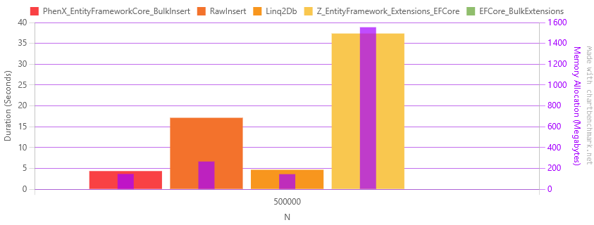
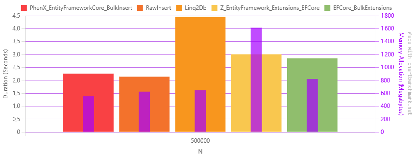

---
# https://vitepress.dev/reference/default-theme-home-page
layout: home

hero:
  name: "PhenX BulkInsert"
  text: "Super fast bulk insert for EF Core"
  tagline: A high-performance, provider-agnostic bulk insert extension for Entity Framework Core 8+. Supports SQL Server, PostgreSQL, SQLite, MySQL and Oracle.

  actions:
    - theme: brand
      text: Getting started
      link: /getting-started
    - theme: alt
      text: GitHub
      link: https://github.com/PhenX/PhenX.EntityFrameworkCore.BulkInsert

features:
  - icon: ⚡️
    title: High Performance
    details: Significantly faster data insertion with optimized SQL generation and batching.
  - icon: 💻
    title: Database Support
    details: Works with SQL Server, PostgreSQL, MySQL, SQLite and Oracle databases.
  - icon: 🔌
    title: Easy Integration
    details: Seamless integration with existing EF Core DbContext and models.
---

## It's fast !

It's also memory efficient, with low allocations and garbage collection pressure, see benchmark results below.

The benchmark consists of inserting 500 000 records into a single table with various column types, using various methods to compare performance.
The results are shown for PostgreSQL, SQL Server, SQLite, MySQL and Oracle databases.

* **PhenX_EntityFrameworkCore_BulkInsert**: this library
* **RawInsert**: naive implementation without any library, using the native provider API (SqlBulkCopy for SQL Server, BeginBinaryImport for PostgreSQL, raw inserts for SQLite)
* **Linq2Db**: https://github.com/linq2db/linq2db
* **Z_EntityFramework_Extensions_EFCore**: https://entityframework-extensions.net/bulk-extensions
* **EFCore_BulkExtensions**: https://github.com/borisdj/EFCore.BulkExtensions

::: info
**EF Core SaveChanges** not included in the benchmark results as it's significantly slower than any bulk insert methods.
:::

The benchmark code is available on [GitHub](https://github.com/PhenX/PhenX.EntityFrameworkCore.BulkInsert/tree/main/tests/PhenX.EntityFrameworkCore.BulkInsert.Benchmark).

### PostgreSQL

| Method                                   |     Mean | Ratio |       Gen0 |      Gen1 | Gen2 | Allocated | Alloc Ratio |
|------------------------------------------|---------:|------:|-----------:|----------:|-----:|----------:|------------:|
| **PhenX_EntityFrameworkCore_BulkInsert** |  1.373 s |  1.01 | 11000.0000 | 1000.0000 |    - |  91.59 MB |        1.00 |
| RawInsert                                |  1.342 s |  0.99 |  2000.0000 | 1000.0000 |    - |  22.91 MB |        0.25 |
| Linq2Db                                  |  1.427 s |  1.05 | 11000.0000 | 1000.0000 |    - |  91.68 MB |        1.00 |
| Z_EntityFramework_Extensions_EFCore      |  3.750 s |  2.76 | 53000.0000 | 1000.0000 |    - | 439.14 MB |        4.79 |
| EFCore_BulkExtensions                    | 13.432 s |  9.88 | 29000.0000 | 2000.0000 |    - | 232.77 MB |        2.54 |

### MySQL

| Method                               |     Mean | Ratio |        Gen0 |       Gen1 |      Gen2 |  Allocated | Alloc Ratio |
|--------------------------------------|---------:|------:|------------:|-----------:|----------:|-----------:|------------:|
| PhenX_EntityFrameworkCore_BulkInsert |  4.369 s |  1.02 |  18000.0000 |  1000.0000 |         - |  147.12 MB |        1.00 |
| RawInsert                            | 17.146 s |  4.00 |  33000.0000 | 13000.0000 | 1000.0000 |  266.41 MB |        1.81 |
| Linq2Db                              |  4.680 s |  1.09 |  18000.0000 |  1000.0000 |         - |  145.13 MB |        0.99 |
| Z_EntityFramework_Extensions_EFCore  | 37.362 s |  8.72 | 192000.0000 |  6000.0000 |         - | 1554.77 MB |       10.57 |
| EFCore_BulkExtensions                |       NA |     ? |          NA |         NA |        NA |         NA |           ? |

### SQLite

| Method                               |    Mean | Ratio |        Gen0 |      Gen1 |      Gen2 |  Allocated | Alloc Ratio |
|--------------------------------------|--------:|------:|------------:|----------:|----------:|-----------:|------------:|
| PhenX_EntityFrameworkCore_BulkInsert | 2.259 s |  1.00 |  69000.0000 | 1000.0000 |         - |  554.55 MB |        1.00 |
| RawInsert                            | 2.141 s |  0.95 |  78000.0000 | 1000.0000 |         - |   625.5 MB |        1.13 |
| Linq2Db                              | 4.452 s |  1.98 |  65000.0000 | 5000.0000 | 2000.0000 |  646.42 MB |        1.17 |
| Z_EntityFramework_Extensions_EFCore  | 3.008 s |  1.34 | 200000.0000 | 1000.0000 |         - | 1613.93 MB |        2.91 |
| EFCore_BulkExtensions                | 2.850 s |  1.27 | 102000.0000 | 1000.0000 |         - |  820.09 MB |        1.48 |

Where are the SQL Server and Oracle benchmarks? [You can run them yourself](https://www.google.com/search?q=dewitt+clause).
